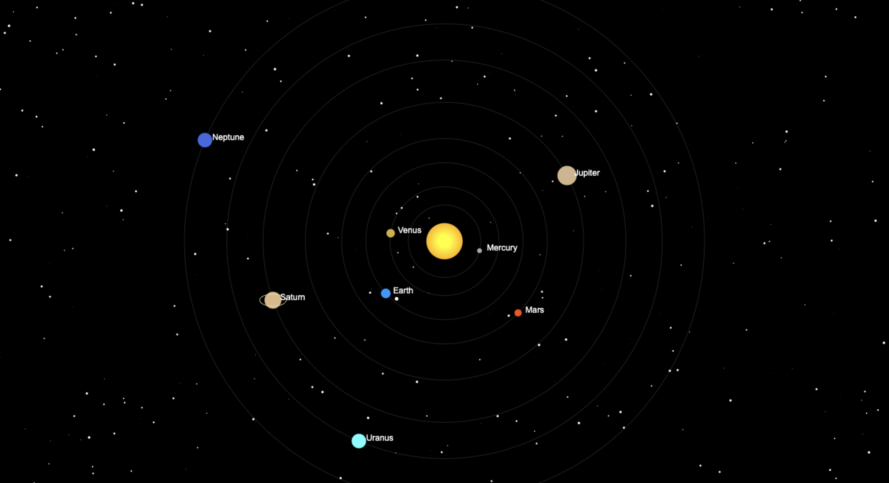

# 🌌 Solar System

An interactive Solar System simulation built using **HTML5 Canvas**, **CSS3**, and **Vanilla JavaScript**.



---

## ✨ Features

- 🌞 Animated Sun
- 🪐 8 Orbiting Planets
- 🌕 Moon orbiting Earth
- ⭐ Random Star Background
- 🛰️ Smooth 60 FPS Animation
- 📱 Responsive Design
- 🪐 Saturn Rings
- 🎨 Canvas Rendering

---

## 🚀 Live Demo

Enable GitHub Pages to view the project online.

```
https://ombhadange.github.io/Solar-System/
```

---

## 🛠️ Technologies

- HTML5
- CSS3
- JavaScript (ES6)
- HTML5 Canvas API

---

## 📂 Project Structure

```
Solar-System
│
├── index.html
├── style.css
├── script.js
├── README.md
├── LICENSE
└── assets
    ├── preview.png
    └── demo.gif
```

---

## ▶️ Installation

Clone the repository

```bash
git clone https://github.com/OmBhadange/Solar-System.git
```

Open the folder

```bash
cd Solar-System
```

Open

```text
index.html
```

No dependencies are required.

---

## 📸 Screenshots

| Home |
|------|
|  |

---

## 📚 What I Learned

- Canvas API
- JavaScript Animation
- requestAnimationFrame()
- Object Animation
- Circular Motion using Math.sin() & Math.cos()
- Responsive Canvas
- Rendering Loops

---

## 🔮 Future Improvements

- Planet Information Panel
- Zoom In / Zoom Out
- Camera Controls
- Asteroid Belt
- Multiple Moons
- Comets
- Planet Textures
- Space Background
- Speed Controls
- Interactive UI

---

## 👨‍💻 Author

**Om Avinash Bhadange**

GitHub

https://github.com/OmBhadange

---

## ⭐ Support

If you like this project, give it a ⭐ on GitHub.